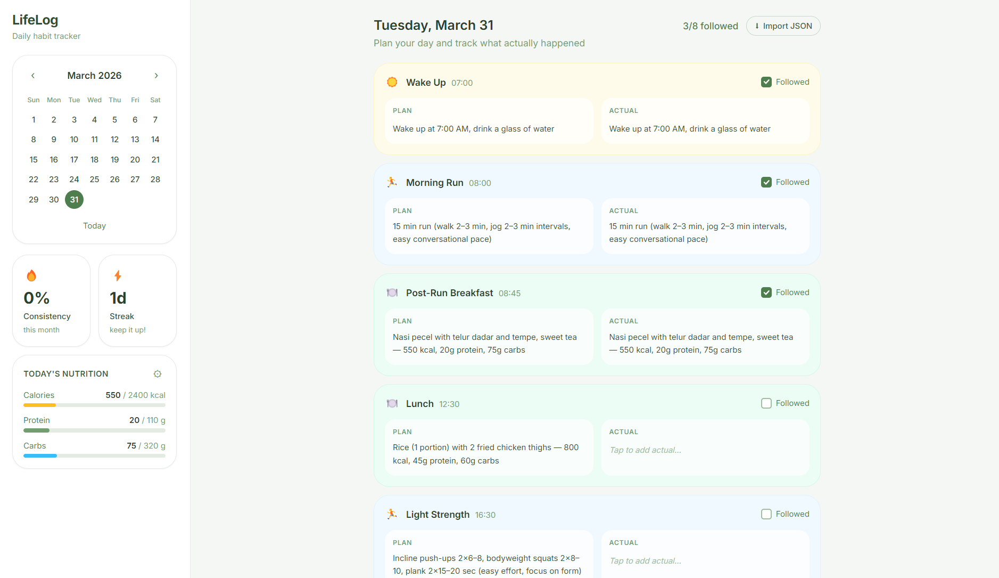

# LifeLog

<p align="center">
  
</p>

<p align="center">
  <strong style="font-size:1.6em">LifeLog — Make healthy habits stick</strong><br/>
  <em>Plan your day, track what happened, and build lasting routines.</em>
</p>

<p align="center">
  <a href="#build--install" style="margin-right:10px; text-decoration:none;">Get the app</a> · <a href="#what-it-does" style="text-decoration:none;">See features</a>
</p>

A desktop app for tracking daily health habits using a **plan vs actual** system.

## What it does

LifeLog lets you plan your day — meals, workouts, sleep, and other habits — then log what actually happened. Each entry has a **Plan**, an **Actual**, and a **Followed** checkbox. Over time, the dashboard shows your consistency and streak so you can see how well you're sticking to your intentions.

There are no restrictions on when you fill things in. You can plan ahead, log in real-time, or fill in actuals days later.

## Tech Stack

- **Vite** — fast dev server and build tool
- **React** — UI framework
- **Tailwind CSS** — utility-first styling
- **Electron** — desktop shell

## Development

```bash
npm install
npm run dev
```

Starts the Vite dev server and opens the Electron window automatically. Hot reload is enabled — changes in `src/` reflect instantly.

## Build & Install

### 1. Build the web assets

```bash
npm run build
```

Compiles React + Tailwind into `dist/`. Required before packaging.

### 2. Package into an installer

```bash
npm run dist
```

Runs `vite build` then `electron-builder`. The output goes into `release/`:

```
release/
  LifeLog Setup 1.0.0.exe   ← Windows installer (NSIS)
```

### 3. Install

Run `LifeLog Setup 1.0.0.exe`. The installer lets you choose the install directory and creates a desktop shortcut and Start Menu entry.

> **Note:** The first build downloads Electron binaries (~100 MB) and may take a few minutes.

## Storage

Data is saved as JSON at:

```
%APPDATA%\lifelog\data.json   (Windows)
~/Library/Application Support/lifelog/data.json   (macOS)
~/.config/lifelog/data.json   (Linux)
```

No account or internet connection required — everything stays local.

## LLM Integration (ChatGPT as Personal Trainer)

LifeLog supports importing a full day plan from an LLM like ChatGPT. Ask your LLM to act as your personal trainer and respond with a plan in the JSON format below. Then paste it into the app using the **Import JSON** button on the timeline.

### Prompt to give ChatGPT

Use the full prompt in [PROMPT.MD](PROMPT.MD) and paste it into your LLM as the instruction/context.

### JSON Format

```json
{
  "date": "2026-03-31",
  "targets": {
    "calories": 2200,
    "protein": 150,
    "carbs": 250
  },
  "entries": [
    {
      "type": "wake-up",
      "label": "Wake Up",
      "time": "06:00",
      "plan": "Wake up at 6:00 AM, drink a large glass of water"
    },
    {
      "type": "meal",
      "label": "Breakfast",
      "time": "07:00",
      "plan": "Oatmeal with banana and peanut butter — 450 kcal, 20g protein, 60g carbs"
    },
    {
      "type": "exercise",
      "label": "Morning Run",
      "time": "08:00",
      "plan": "30 min easy run at conversational pace, ~5 km"
    },
    {
      "type": "meal",
      "label": "Lunch",
      "time": "12:30",
      "plan": "Grilled chicken breast, rice, steamed broccoli — 650 kcal, 55g protein, 70g carbs"
    },
    {
      "type": "exercise",
      "label": "Evening Workout",
      "time": "17:00",
      "plan": "Upper body: chest press 4x10, rows 4x10, shoulder press 3x12 — 45 min"
    },
    {
      "type": "meal",
      "label": "Dinner",
      "time": "19:00",
      "plan": "Salmon fillet, sweet potato, side salad — 600 kcal, 45g protein, 50g carbs"
    },
    {
      "type": "other",
      "label": "Sleep",
      "time": "22:30",
      "plan": "In bed by 10:30 PM, no screens 30 min before"
    }
  ]
}
```

### Field reference

| Field              | Required | Values                                                                                            |
| ------------------ | -------- | ------------------------------------------------------------------------------------------------- |
| `date`             | optional | `YYYY-MM-DD` — imports into that date; otherwise uses the selected date in the app                |
| `targets.calories` | optional | Daily calorie target (kcal)                                                                       |
| `targets.protein`  | optional | Daily protein target (g)                                                                          |
| `targets.carbs`    | optional | Daily carb target (g)                                                                             |
| `type`             | required | `wake-up` · `meal` · `exercise` · `other`                                                         |
| `label`            | required | Display name for the entry                                                                        |
| `time`             | optional | `HH:MM` (24-hour)                                                                                 |
| `plan`             | optional | Free text. Include nutrition as `Xkcal`, `Xg protein`, `Xg carbs` so the dashboard can parse them |

### Import behavior

- Importing **replaces** all existing entries for that day.
- If `targets` is present, it also updates the day's nutrition targets.
- You can still add, edit, or delete entries and adjust targets manually after importing.
